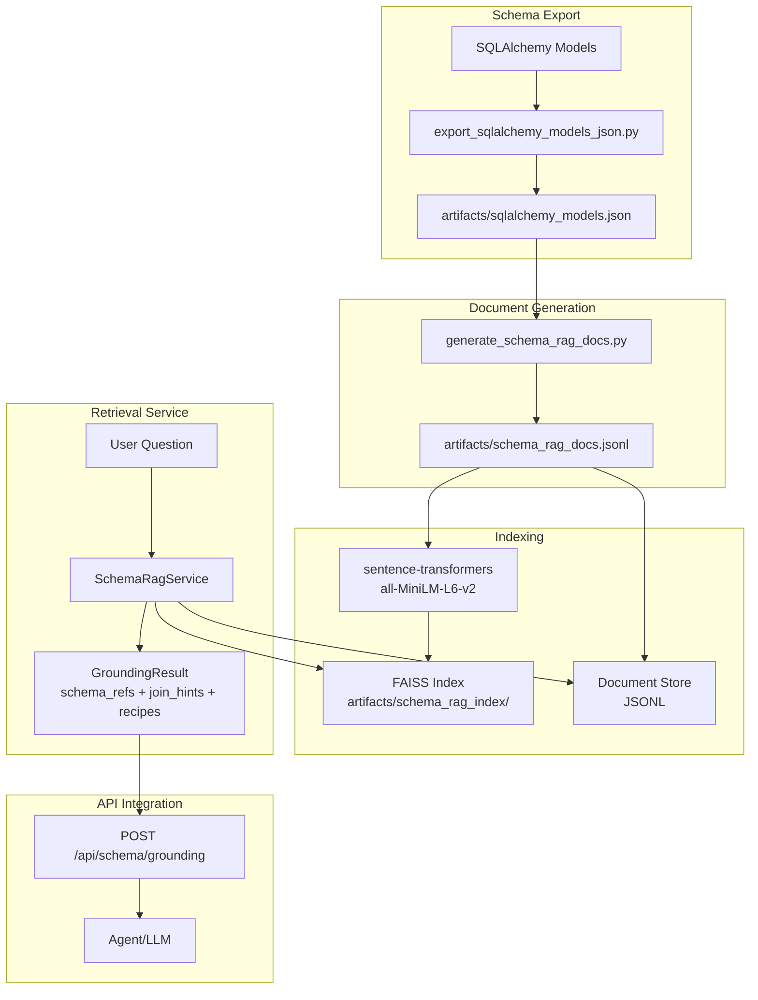

# Schema RAG Architecture

## Overview

Schema RAG (Retrieval Augmented Generation) is a proof-of-concept system that enables agents to ground their responses in the SQLAlchemy database schema before answering questions. It embeds both schema documentation (models, columns) and query recipes (join/filter patterns) into a FAISS vector index, allowing semantic retrieval of relevant schema information.

## Architecture Diagram



## System Components

### 1. Schema Export

**Script**: `scripts/export_sqlalchemy_models_json.py` (optional, provided as example)

Exports SQLAlchemy models to structured JSON format:
- Inspects all models in your project
- Extracts metadata: table names, columns, types, relationships, foreign keys
- Outputs to JSON file
- Includes relationship mappings and foreign key paths for join hints

### 2. Document Generation

**Script**: `scripts/generate_schema_rag_docs.py`

Generates three types of documents from the schema JSON:

#### Document Types

1. **schema_model** (one per ORM model)
   - **Text**: Model description, table name, relationships
   - **Metadata**: model name, table name, source file
   - **ID Format**: `schema_model:{module}.{model}`

2. **schema_column** (one per column)
   - **Text**: Column description with natural language aliases (e.g., "success count", "number of successes")
   - **Metadata**: model, table, column, type, nullable, source file
   - **Keywords**: Extracted from column name and description
   - **ID Format**: `schema_column:{module}.{model}.{column}`

3. **query_recipe** (template-generated recipes for common patterns)
   - **Text**: Join/filter patterns (e.g., "success count for program name")
   - **Metadata**: join_hints array, keywords, semantics notes
   - **Example**: "Join programs to program_statistics on programs.id = program_statistics.program_id. Filter by programs.name. Return program_statistics.success_count."
   - **ID Format**: `query_recipe:{slug}`

**Output**: JSONL file (one JSON object per line)

### 3. FAISS Index Builder

**Script**: `scripts/build_schema_rag_index.py`

Builds the vector index:
- Loads documents from JSONL
- Generates embeddings using `sentence-transformers` with `all-MiniLM-L6-v2`
- Creates FAISS IndexFlatL2 index (simple, exact search)
- Saves index and metadata to output directory

**Storage Structure**:
```
artifacts/schema_rag_index/
  ├── faiss.index          # FAISS vector index
  ├── docs.jsonl           # Document metadata (for retrieval)
  └── config.json          # Index metadata (dimension, model name)
```

### 4. Schema RAG Service

**File**: `schema_rag/service.py`

Core retrieval service with hybrid search strategy:

#### Retrieval Strategy

1. **Vector Similarity**: Query embedding → FAISS search → top-k documents
2. **Lexical Boost**: Boost documents with exact keyword matches (column names, model names)
3. **Metadata Filtering**: Boost documents matching question context (e.g., "program" → boost Program/ProgramStatistics docs)

#### GroundingResult Structure

```python
@dataclass
class GroundingResult:
    docs: List[Dict]          # Retrieved documents with scores
    schema_refs: List[Dict]  # Normalized schema references
    join_hints: List[str]    # Join path strings
    recipes: List[Dict]      # Query recipe matches
    ambiguities: List[str]   # Semantic notes (e.g., variant_id handling)
```

#### Key Features

- Hybrid ranking (vector + lexical)
- Entity extraction from questions (e.g., program name)
- Join hint normalization from recipes
- Ambiguity detection (e.g., variant_id semantics)
- Query expansion with synonyms

### 5. Query Tool

**Script**: `scripts/query_schema_rag.py`

Command-line tool for testing queries:
```bash
python scripts/query_schema_rag.py "What is the success count for the forest fire program"
```

## Design Decisions

### Technology Choices

1. **FAISS IndexFlatL2**: Simple exact search, sufficient for POC scale
2. **sentence-transformers all-MiniLM-L6-v2**: Lightweight (80MB), fast, good quality
3. **Standalone Package**: Independent package that can be integrated into any project
4. **On-Disk Storage**: All artifacts in `artifacts/` directory, fully rebuildable

### Architecture Principles

1. **Hybrid Retrieval**: Combines vector similarity with lexical matching for better precision
2. **Deterministic IDs**: Enable safe upsert/rebuild of index
3. **Template-Based Recipes**: Start with generated recipes, can add curated ones later
4. **Semantic Grounding**: Returns structured references, not just raw text

## Data Flow

1. **Build Time**:
   - Export SQLAlchemy models → JSON (optional, you can provide your own schema JSON)
   - Generate documents (models, columns, recipes) → JSONL
   - Generate embeddings → FAISS index

2. **Query Time**:
   - User question → Embed query
   - FAISS search → Top-k documents
   - Hybrid ranking → Boost lexical matches
   - Extract schema refs, join hints, recipes → GroundingResult

## Example Use Case

**Question**: "What is the success count for the forest fire program"

**Retrieved Grounding**:
- **Schema Reference**: `ProgramStatistics.success_count`
- **Join Hints**: 
  - `program_statistics.program_id -> programs.id`
  - Filter by `programs.name = "forest fire"`
- **Recipe**: "Join programs to program_statistics on programs.id = program_statistics.program_id. Filter programs.name by the user's program name. Return program_statistics.success_count."
- **Ambiguity Note**: "If multiple rows exist due to variants (variant_id), either sum across rows or choose variant_id IS NULL depending on requested semantics."

## Build/Run Flow

1. **Generate documents** (from your schema JSON):
   ```bash
   python scripts/generate_schema_rag_docs.py --schema artifacts/sqlalchemy_models.json --out artifacts/schema_rag_docs.jsonl
   ```

2. **Build index**:
   ```bash
   python scripts/build_schema_rag_index.py --docs artifacts/schema_rag_docs.jsonl --out artifacts/schema_rag_index/
   ```

3. **Query (CLI)**:
   ```bash
   python scripts/query_schema_rag.py "What is the success count for the forest fire program"
   ```

4. **Use in Python**:
   ```python
   from schema_rag import SchemaRagService
   from pathlib import Path
   
   service = SchemaRagService(Path("artifacts/schema_rag_index"))
   result = service.retrieve_grounding("What is the success count for the forest fire program")
   
   print(result.schema_refs)
   print(result.join_hints)
   ```

## File Structure

```
schema_rag/
  ├── schema_rag/              # Main package
  │   ├── __init__.py
  │   ├── service.py           # SchemaRagService
  │   └── schema_synonyms.json # Query expansion synonyms
  ├── scripts/                 # Utility scripts
  │   ├── generate_schema_rag_docs.py
  │   ├── build_schema_rag_index.py
  │   └── query_schema_rag.py
  ├── docs/                    # Documentation
  │   └── SCHEMA_RAG.md
  ├── tests/                   # Test suite
  ├── requirements.txt         # Dependencies
  └── README.md                # This file
```

## Testing Strategy

### Acceptance Test (Minimum)

**Question**: "What is the success count for the forest fire program"

**Assertions**:
- Returns at least one `schema_column` doc with:
  - `model == "ProgramStatistics"`
  - `column == "success_count"`
- Returns join hints including:
  - `program_statistics.program_id -> programs.id`
  - `programs.name` (or equivalent linkage)

### Additional Test Cases

- "How many failures for program forest fire?" → `ProgramStatistics.failure_count`
- "How many times was forest fire run?" → `ProgramStatistics.usage_count`
- "Average execution time for forest fire program" → `ProgramStatistics.avg_execution_time`

## Future Considerations

- **Variant Semantics**: Choose default policy (sum across variants vs base-only) and document it
- **Name Matching**: Implement fuzzy matching for program names
- **Curated Recipes**: Add hand-authored recipes for complex query patterns
- **Query Execution**: Optional path to execute queries (with parameterization and security controls)
- **Production Vector Store**: Migrate to pgvector/Qdrant for production scale
- **Background Re-indexing**: Automatically rebuild index when schema changes
