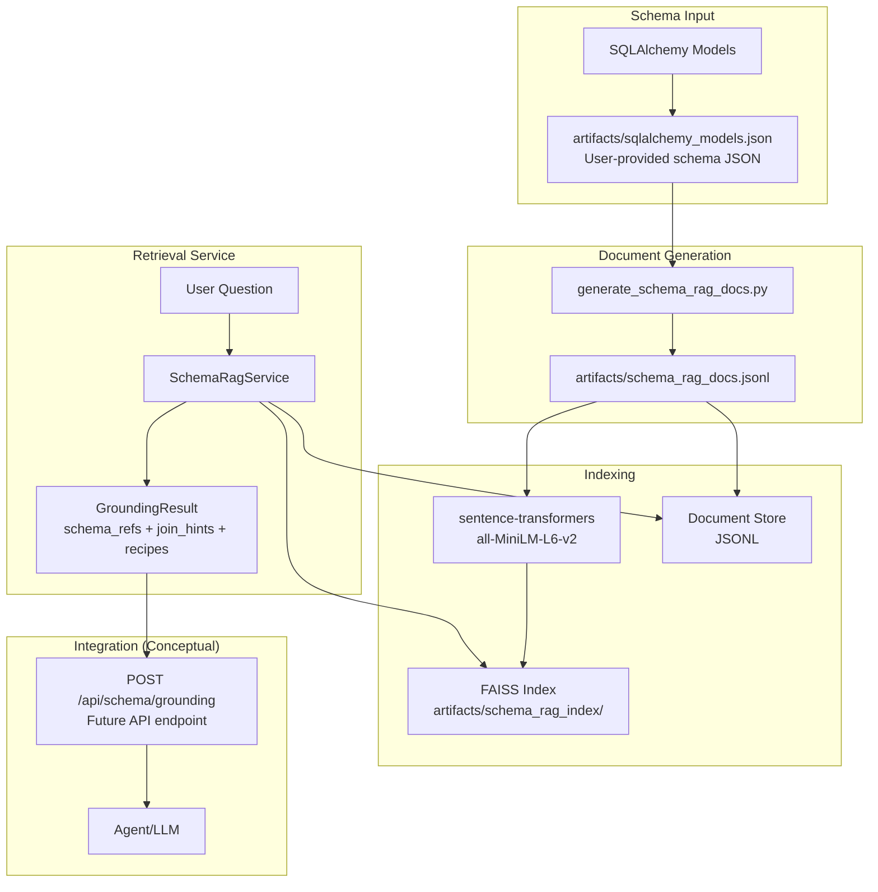

# Schema RAG Architecture

## Overview

Schema RAG (Retrieval Augmented Generation) is a proof-of-concept system that enables agents to ground their responses in the SQLAlchemy database schema before answering questions. It embeds both schema documentation (models, columns) and query recipes (join/filter patterns) into a FAISS vector index, allowing semantic retrieval of relevant schema information.

## Architecture Diagram



## System Components

### 1. Schema Input

**Input**: `artifacts/sqlalchemy_models.json` (user-provided)

The system requires a schema JSON file in a specific format. You need to provide this file yourself - it should contain:
- Model metadata: table names, columns, types, relationships, foreign keys
- Relationship mappings and foreign key paths for join hints
- Column metadata: types, nullable flags, defaults

The schema JSON format should match the structure expected by `generate_schema_rag_docs.py`. See `artifacts/sqlalchemy_models.json` for an example of the expected JSON structure. You can export this from your SQLAlchemy models using your own tooling or create it manually.

### 2. Document Generation

**Script**: `scripts/generate_schema_rag_docs.py`

Generates three types of documents from the schema JSON:

#### Document Types

1. **schema_model** (one per ORM model)
   - **Text**: Model description, table name, relationships
   - **Metadata**: model name, table name, source file
   - **ID Format**: `schema_model:{module}.{model}`

2. **schema_column** (one per column)
   - **Text**: Column description with natural language aliases (e.g., "success count", "number of successes")
   - **Metadata**: model, table, column, type, nullable, source file
   - **Keywords**: Extracted from column name and description
   - **ID Format**: `schema_column:{module}.{model}.{column}`

3. **query_recipe** (template-generated recipes for common patterns)
   - **Text**: Join/filter patterns (e.g., "success count for program name")
   - **Metadata**: join_hints array, keywords, semantics notes
   - **Example**: "Join programs to program_statistics on programs.id = program_statistics.program_id. Filter by programs.name. Return program_statistics.success_count."
   - **ID Format**: `query_recipe:{slug}`

**Output**: JSONL file (one JSON object per line)

### 3. FAISS Index Builder

**Script**: `scripts/build_schema_rag_index.py`

Builds the vector index:
- Loads documents from JSONL
- Generates embeddings using `sentence-transformers` with `all-MiniLM-L6-v2`
- Creates FAISS IndexFlatL2 index (simple, exact search)
- Saves index and metadata to output directory

**Storage Structure**:
```
artifacts/schema_rag_index/
  ├── faiss.index          # FAISS vector index
  ├── docs.jsonl           # Document metadata (for retrieval)
  └── config.json          # Index metadata (dimension, model name)
```

### 4. Schema RAG Service

**File**: `schema_rag/service.py`

Core retrieval service with hybrid search strategy:

#### Retrieval Strategy

The service uses a sophisticated hybrid ranking system with multiple scoring components:

1. **Vector Similarity**: Query embedding → FAISS search → top-k documents (base score)
2. **Lexical Boost**: Boost documents with exact keyword matches (column names, model names, table names)
   - Column name matches: +3.0
   - Model name matches: +2.0
   - Table name matches: +1.5
   - Status column special handling: +4.0 base + up to +2.0 for specific status values
3. **Exact Match Boost**: +6.0 when both model and column keywords match the query
4. **Recipe Pattern Boost**: Prioritizes curated query recipes
   - Curated recipes: +4.0 base boost
   - Pattern-based boosts: +2.0 for matching patterns (aggregation, temporal, status, relationship)
5. **Entity-Based Boost**: Context-aware boosting based on extracted entities
   - Program name matches: +3.0
   - Temporal column matches: +2.0 base, +2.0 for specific temporal types
   - Numeric column matches: +1.0
6. **Penalty System**: Demotes clearly incorrect matches
   - No keyword matches + low vector score: -3.0
   - Domain mismatches + low vector score: -2.0

#### GroundingResult Structure

```python
@dataclass
class GroundingResult:
    docs: List[Dict]          # Retrieved documents with scores
    schema_refs: List[Dict]  # Normalized schema references
    join_hints: List[str]    # Join path strings
    recipes: List[Dict]      # Query recipe matches
    ambiguities: List[str]   # Semantic notes (e.g., variant_id handling)
```

#### Key Features

- **Hybrid Ranking**: Multi-component scoring system combining vector similarity, lexical matching, exact matches, and pattern recognition
- **Entity Extraction**: Extracts program names, dates, temporal types, and numeric filters from questions
- **Enhanced Query Expansion**: Bidirectional synonym expansion with multi-word phrase support (2-4 word phrases)
- **Recipe Prioritization**: Curated recipes receive higher priority with pattern-based boosts
- **Intelligent Penalties**: Demotes incorrect matches to improve precision
- **Join Hint Normalization**: Extracts and normalizes join paths from recipes
- **Ambiguity Detection**: Identifies semantic ambiguities (e.g., variant_id semantics)
- **Temporal Pattern Recognition**: Enhanced detection of created/updated/executed temporal queries

### 5. Query Tool

**Script**: `scripts/query_schema_rag.py`

Command-line tool for testing queries:
```bash
python scripts/query_schema_rag.py "What is the success count for the forest fire program"
```

## Design Decisions

### Technology Choices

1. **FAISS IndexFlatL2**: Simple exact search, sufficient for POC scale
2. **sentence-transformers all-MiniLM-L6-v2**: Lightweight (80MB), fast, good quality
3. **Standalone Package**: Independent package that can be integrated into any project
4. **On-Disk Storage**: All artifacts in `artifacts/` directory, fully rebuildable

### Architecture Principles

1. **Hybrid Retrieval**: Combines vector similarity with lexical matching, exact match detection, and pattern recognition for high precision (80.9% model+column match rate)
2. **Multi-Component Scoring**: Uses vector scores, lexical boosts, exact match boosts, recipe pattern boosts, entity boosts, and penalties to rank results
3. **Deterministic IDs**: Enable safe upsert/rebuild of index
4. **Curated Recipe Priority**: Curated recipes are prioritized over template-generated ones with pattern-based boosts
5. **Semantic Grounding**: Returns structured references, not just raw text
6. **Bidirectional Synonym Expansion**: Query expansion works in both directions and supports multi-word phrases

## Data Flow

1. **Build Time**:
   - Provide schema JSON file (user must export/create from SQLAlchemy models)
   - Generate documents (models, columns, recipes) → JSONL
   - Generate embeddings → FAISS index

2. **Query Time**:
   - User question → Expand with synonyms (bidirectional, multi-word phrases)
   - Embed expanded query → FAISS search → Top-k documents
   - Extract entities (program names, dates, temporal types, numeric filters)
   - Multi-component scoring:
     * Vector similarity (base score)
     * Lexical boost (keyword matches)
     * Exact match boost (model+column matches)
     * Recipe pattern boost (curated recipes, pattern matching)
     * Entity boost (context-aware)
     * Penalties (incorrect matches)
   - Extract schema refs, join hints, recipes → GroundingResult

## Example Use Case

**Question**: "What is the success count for the forest fire program"

**Retrieved Grounding**:
- **Schema Reference**: `ProgramStatistics.success_count`
- **Join Hints**: 
  - `program_statistics.program_id -> programs.id`
  - Filter by `programs.name = "forest fire"`
- **Recipe**: "Join programs to program_statistics on programs.id = program_statistics.program_id. Filter programs.name by the user's program name. Return program_statistics.success_count."
- **Ambiguity Note**: "If multiple rows exist due to variants (variant_id), either sum across rows or choose variant_id IS NULL depending on requested semantics."

## Build/Run Flow

1. **Generate documents** (from your schema JSON):
   ```bash
   python scripts/generate_schema_rag_docs.py --schema artifacts/sqlalchemy_models.json --out artifacts/schema_rag_docs.jsonl
   ```

2. **Build index**:
   ```bash
   python scripts/build_schema_rag_index.py --docs artifacts/schema_rag_docs.jsonl --out artifacts/schema_rag_index/
   ```

3. **Query (CLI)**:
   ```bash
   python scripts/query_schema_rag.py "What is the success count for the forest fire program"
   ```

4. **Use in Python**:
   ```python
   from schema_rag import SchemaRagService
   from pathlib import Path
   
   service = SchemaRagService(Path("artifacts/schema_rag_index"))
   result = service.retrieve_grounding("What is the success count for the forest fire program")
   
   print(result.schema_refs)
   print(result.join_hints)
   ```

## File Structure

```
schema_rag/
  ├── schema_rag/              # Main package
  │   ├── __init__.py
  │   ├── service.py           # SchemaRagService
  │   └── schema_synonyms.json # Query expansion synonyms
  ├── scripts/                 # Utility scripts
  │   ├── generate_schema_rag_docs.py
  │   ├── build_schema_rag_index.py
  │   └── query_schema_rag.py
  ├── docs/                    # Documentation
  │   └── SCHEMA_RAG.md
  ├── tests/                   # Test suite
  ├── requirements.txt         # Dependencies
  └── README.md                # This file
```

## Testing Strategy

### Comprehensive Test Suite

The system includes a comprehensive test suite with 110 natural language questions. Test results show:

- **80.9% precision** for model+column matching (up from 58.2%)
- **96.4% precision** for model matching (up from 67.3%)
- **Average top score**: 19.14 (up from 13.86, +38.1% improvement)
- **Average schema refs per query**: 3.54 (up from 1.35, +162% improvement)

See [artifacts/SCORING_REFINEMENT_TEST_RESULTS.md](../artifacts/SCORING_REFINEMENT_TEST_RESULTS.md) for detailed test results and validation.

### Acceptance Test (Minimum)

**Question**: "What is the success count for the forest fire program"

**Assertions**:
- Returns at least one `schema_column` doc with:
  - `model == "ProgramStatistics"`
  - `column == "success_count"`
- Returns join hints including:
  - `program_statistics.program_id -> programs.id`
  - `programs.name` (or equivalent linkage)
- Top document should have high score (typically >25.0) due to exact match boost

### Additional Test Cases

- "How many failures for program forest fire?" → `ProgramStatistics.failure_count`
- "How many times was forest fire run?" → `ProgramStatistics.usage_count`
- "Average execution time for forest fire program" → `ProgramStatistics.avg_execution_time`
- "Program variants for a specific program" → `ProgramVariant.name` (exact match boost)
- "Local LLM decision run status" → `LocalLLMDecisionRun.status` (status column boost)

## Scoring System Details

The scoring system uses multiple components to rank documents:

### Score Components

1. **Vector Score** (base): Semantic similarity from FAISS (typically 0.0-1.0)
2. **Lexical Boost**: Keyword matching in metadata and text
3. **Exact Match Boost**: +6.0 when both model and column keywords match
4. **Recipe Boost**: 
   - +4.0 for curated recipes
   - +2.0 for pattern matches (aggregation, temporal, status, relationship)
5. **Entity Boost**: Context-aware boosts based on extracted entities
6. **Penalty**: Negative adjustments for incorrect matches

### Example Score Breakdown

For query "What is the success count for the forest fire program":
- Vector Score: ~1.0
- Lexical Boost: ~3.0 (column name match)
- Exact Match Boost: +6.0 (model="ProgramStatistics", column="success_count")
- Recipe Boost: +6.0 (curated + aggregation pattern)
- Entity Boost: ~3.98 (program name match)
- Penalty: 0.0
- **Final Score: ~29.98**

## Future Considerations

- **Variant Semantics**: Choose default policy (sum across variants vs base-only) and document it
- **Name Matching**: Implement fuzzy matching for program names
- **Query Execution**: Optional path to execute queries (with parameterization and security controls)
- **Production Vector Store**: Migrate to pgvector/Qdrant for production scale
- **Background Re-indexing**: Automatically rebuild index when schema changes
- **Synonym Learning**: Automatically learn synonyms from query patterns